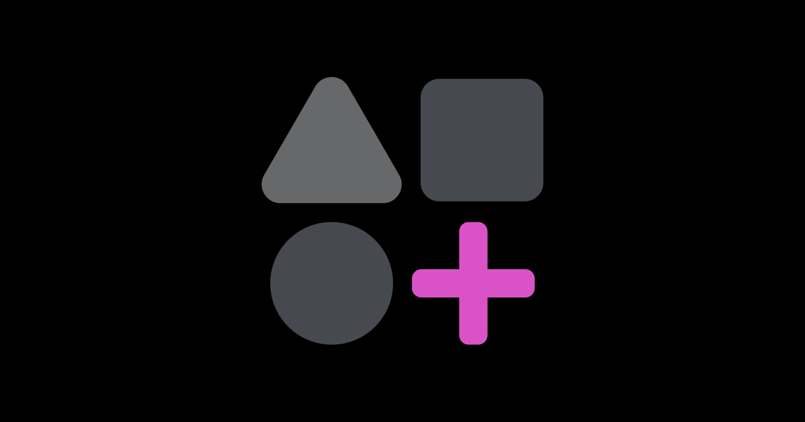

# 🌿 EcoTala - Eco-Friendly Actions on Base Blockchain



**EcoTala** is a revolutionary mini-app built on Base blockchain for the **Base Philippines Campus Mini App Challenge**. It empowers all Filipinos to take verified eco-friendly actions, earn blockchain rewards, and collectively tackle the Philippines' environmental challenges through the power of community and technology.

## 🚀 Project Overview

EcoTala addresses the Philippines' critical waste crisis (8,600 tons daily in Metro Manila alone) by gamifying environmental action through blockchain technology. Users log eco-friendly activities with photo proof, earn points or NFTs stored on Base, and track both personal progress and collective community impact.

With seamless Base Wallet integration, gasless transactions, and social sharing capabilities, EcoTala makes sustainability accessible, rewarding, and fun for Filipinos of all ages while showcasing the practical applications of blockchain technology.

## ✨ Core Features

### 🔐 **User Login**

- **One-click Base Wallet authentication** using Coinbase smart wallet
- Secure, simple identification without complex signups
- Persistent wallet sessions across page reloads
- Perfect for Filipinos of all technical backgrounds

### 📸 **Log Eco-Action with Proof**

- Choose from eco-actions: Recycle Plastic, Tree Planting, Clean Drive, etc.
- **Photo proof verification** uploaded to IPFS and stored on Base blockchain
- Real-time validation and transaction confirmation
- Ensures action legitimacy and builds community trust

### 🏆 **Reward System**

- Earn **points** (10 per verified action) stored in Base Wallet
- **NFT badges** for milestones: Eco Starter → Waste Warrior → Tree Guardian → Climate Hero
- Gasless transactions using Base's efficient infrastructure
- Gamified progression system encouraging continuous participation

### 📊 **Personal Dashboard**

- Track total points, badges earned, and action history
- Visual progress tracking with photo thumbnails
- Achievement milestones and weekly goal monitoring
- Personal environmental impact metrics (CO₂ saved, waste diverted)

### 🌍 **Community Stats**

- Real-time collective impact: _"10,000 users saved 5 tons of waste!"_
- Regional competition: Metro Manila vs Cebu vs Davao leaderboards
- Growth analytics and community milestone celebrations
- Emphasizes **bayanihan** values and Filipino community pride

### 📱 **Share Feature**

- Share achievements on Twitter/X, Facebook, LinkedIn
- Pre-made templates highlighting personal and community impact
- Custom message creation with Filipino-focused hashtags
- Viral growth potential driving organic adoption

## 🛠️ Technology Stack

- **Frontend**: Next.js 15, TypeScript, Tailwind CSS
- **Blockchain**: Base Sepolia, OnchainKit, wagmi
- **Wallet**: Coinbase Smart Wallet with gasless transactions
- **Storage**: IPFS (Pinata) for decentralized photo storage
- **Deployment**: Vercel with Redis for notifications

## 🎯 Why EcoTala Matters

### **Environmental Impact**

- Addresses Philippines' 8,600 tons daily waste crisis in Metro Manila
- Promotes sustainable practices: recycling, reforestation, clean drives
- Creates verified environmental action database on blockchain

### **Community Engagement**

- Leverages Filipino **bayanihan** spirit for collective action
- Regional pride through city-vs-city environmental competition
- Social sharing amplifies awareness and adoption

### **Blockchain Innovation**

- Practical Web3 application solving real-world problems
- Gasless transactions remove barriers to participation
- Demonstrates Base blockchain's scalability and user-friendliness

### **Social Inclusion**

- Accessible to all economic backgrounds through free transactions
- Mobile-first design optimized for Filipino smartphone users
- Educational component building environmental awareness

## 🚀 Future Features Roadmap

### 🎥 **Video Proof Option**

Allow users to upload 10-15 second video clips as proof for eco-actions, stored on IPFS with hash on Base. Videos provide more convincing evidence for high-value actions like tree planting and appeal to younger users who prefer video content.

### 🛒 **Reward Redemption Marketplace**

Enable users to redeem points for real-world perks from Filipino eco-friendly brands - discounts at Manila coffee shops, reusable tumblers, event tickets. Smart contracts on Base will process redemptions, creating economic value and business partnerships.

### 🏙️ **Localized Community Challenges**

Introduce city and barangay-specific challenges like _"Quezon City: Reduce 1 ton of plastic this month!"_ with real-time leaderboards. Leverages Filipino regional pride and bayanihan spirit while addressing local environmental issues.

### 🤖 **AI-Powered Proof Verification**

Implement AI to automatically verify photo/video proof (detecting recycling, reusable cups, etc.) before awarding points. Reduces manual verification, speeds up rewards, and ensures fairness at scale.

### 📚 **Eco-Education Hub**

Add educational content with tips, videos, and quizzes on sustainable practices tailored for Filipino communities. Reward bonus points for engagement, making EcoTala a comprehensive environmental education platform.

### 🎨 **Creative Recycling NFT Gallery with Auction**

Allow users to submit creative recycled projects (art or crafts made from plastic bottles, like planters or puppets) as eco-action proof. Each verified project is minted as a unique NFT on Base blockchain and showcased in a public gallery for community viewing. Users can auction their NFTs to others using points or ETH via MiniKit, with proceeds supporting creators or donated to Philippine eco-causes. This feature promotes upcycling, reduces waste creatively, and turns sustainability into an artistic, economic opportunity for Filipinos.

## 🏗️ Getting Started

### Prerequisites

- Node.js 18+ and npm
- Base Sepolia testnet wallet
- Environment variables for OnchainKit integration

### Installation

1. **Clone the repository**

   ```bash
   git clone https://github.com/crtzn/eco_tala.git
   cd eco_tala
   ```

2. **Install dependencies**

   ```bash
   npm install
   ```

3. **Set up environment variables**

   ```bash
   # Copy example environment file
   cp .env.example .env.local

   # Add your API keys:
   NEXT_PUBLIC_ONCHAINKIT_API_KEY=your_onchainkit_api_key
   NEXT_PUBLIC_ONCHAINKIT_PROJECT_NAME=EcoTala
   NEXT_PUBLIC_URL=http://localhost:3000
   ```

4. **Start development server**

   ```bash
   npm run dev
   ```

5. **Open in browser**
   Navigate to `http://localhost:3000`

## 🔧 Smart Contract Integration

EcoTala uses a custom smart contract deployed on Base Sepolia:

- **Contract Address**: `0xEdE302BF7539d654Fa18372646008c40436D0f01`
- **Network**: Base Sepolia (Chain ID: 84532)
- **Functions**: `logAction()` for recording verified eco-actions
- **Gas**: Gasless transactions via Base paymaster

## 📱 Usage Guide

1. **Connect Wallet**: One-click login with Base Wallet
2. **Choose Action**: Select from recycling, tree planting, clean drives
3. **Upload Proof**: Take photo showing your eco-action
4. **Verify & Earn**: Get points and NFT badges on successful verification
5. **Track Progress**: Monitor personal and community impact
6. **Share Success**: Spread the word on social media

## 🌟 Impact Metrics

- **Individual Tracking**: Points earned, actions completed, CO₂ saved
- **Community Stats**: Total users, collective waste diverted, trees planted
- **Regional Competition**: City-by-city leaderboards driving friendly competition
- **Social Reach**: Viral sharing templates for organic growth

## 🏆 Hackathon Highlights

### **Technical Innovation**

- Seamless Base blockchain integration with gasless transactions
- IPFS-based decentralized storage for photo proof
- Real-time notification system and responsive design

### **Social Impact**

- Addresses real environmental crisis in the Philippines
- Community-driven approach leveraging Filipino bayanihan values
- Scalable solution for nationwide adoption

### **User Experience**

- Mobile-first design optimized for Filipino smartphone users
- One-click wallet authentication removing technical barriers
- Gamified progression system encouraging sustained engagement

## 📞 Contact & Links

- **Demo**: [https://ecotala.vercel.app/](https://ecotala.vercel.app/)
- **Demo-video**:https://drive.google.com/file/d/1O5R8PIpfic4Gya5Q_IuuV8KHhJbBQ10G/view?usp=sharing
- **Creator**: [@cortezano_dev](https://x.com/cortezano_dev)
- **GitHub**: [https://github.com/crtzn/eco_tala](https://github.com/crtzn/eco_tala)
- **Base Contract**: [View on Basescan](https://sepolia.basescan.org/address/0xEdE302BF7539d654Fa18372646008c40436D0f01)

## 🎉 Acknowledgments

Built for the **Base Philippines Campus Mini App Challenge** with love for the Filipino community and our shared environment. Special thanks to the Base team for creating accessible blockchain infrastructure that enables projects like EcoTala to flourish.

**Together, through bayanihan and technology, we can make the Philippines the greenest archipelago in Southeast Asia! 🇵🇭🌿**

---

_Built on Base Blockchain 🌿 | Created by [@cortezano](https://x.com/cortezano_dev)_
